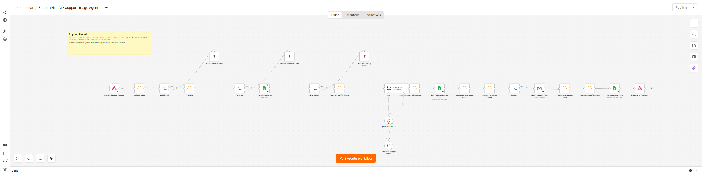

# SupportPilot AI

When an authenticated support webhook receives a customer message, save one ticket, alert a human if needed, return a suggested reply, and stop.

These images show a local n8n editor. Red icons mean credentials still need to be connected on your own instance.

[Webhook and checks](screenshots/n8n-start.png) · [Ticket and response steps](screenshots/n8n-finish.png)

## What it does

The caller sends a request_id and message to the supportpilot-triage webhook. The workflow checks the input, asks OpenAI to classify it and suggest a reply, and saves a Tickets row. It emails the support team for sensitive or low-confidence cases. Replies can follow the customer's English or Filipino, but staff must review them. Refunds, payment disputes, legal issues, and account security go to a human. This workflow never issues refunds, changes accounts, or emails a customer.

Success means a Tickets row keyed by Ticket ID and a JSON response. An escalated ticket also has a Gmail notice in its n8n execution. Customer support owns this workflow.

## Set up

1. On self-hosted n8n, import SupportPilot AI.json and Failure Alert.json. Connect OpenAI, Google Sheets, Gmail, and a Header Auth credential. Require the caller to send that header over HTTPS. Restrict the Google account to the support sheet and mailbox.
2. Make a Tickets tab with these exact headers: Ticket ID, Run ID, Date, Customer, Email, Channel, Category, Priority, Sentiment, Confidence, Summary, Suggested Reply, Escalated, Status.
3. Set SUPPORT_SHEET_ID, SUPPORT_EMAIL_TO, SUPPORT_COMPANY_NAME, SUPPORT_COMPANY_INFO, and SUPPORT_ALERT_EMAIL_TO in the server environment. SUPPORT_COMPANY_INFO must be approved support policy text. Optional: SUPPORT_ESCALATE_BELOW=0.6. Keep API keys in n8n credentials. Set N8N_BLOCK_ENV_ACCESS_IN_NODE=false on this dedicated instance.
4. In the main workflow's n8n Settings, choose Failure Alert as its Error Workflow. Connect its Gmail node and test delivery to the support operator. Use an ingress rate limit for the webhook. Set N8N_CONCURRENCY_PRODUCTION_LIMIT=1 to reduce overlapping production runs; this does not serialize every manual run.

SUPPORT_ENABLED=true allows a run. Dry run is on unless SUPPORT_DRY_RUN=false. Dry run stops before Sheets, OpenAI, and Gmail. Set SUPPORT_ENABLED=false and deactivate the workflow to stop new requests.

## Test before using real messages

1. Run python smoke_test.py after edits. It exits nonzero on failure. GitHub Actions runs it on pushes and pull requests.
2. Enable the flag and leave dry run on. POST a sample request with Header Auth; confirm dry_run and no external calls.
3. Use a test sheet and inbox, set SUPPORT_DRY_RUN=false, and POST a sample with a stable request_id. Check the ticket and response. POST it again; it should say already_recorded, with no second ticket or notice.
4. Test an empty message, a payment dispute in Filipino, and Failure Alert delivery.

Example request after you set your own URL and Header Auth token:

    curl -X POST https://YOUR-N8N/webhook/supportpilot-triage -H 'Content-Type: application/json' -H 'X-Workflow-Key: YOUR-TOKEN' -d '{"request_id":"ticket_123","message":"Kumusta, doble ang charge ko."}'

## If something fails

n8n logs the time, run ID, and result; Failure Alert emails SUPPORT_ALERT_EMAIL_TO. Tickets that need a team notice start as Escalation pending and change to Escalated only after Gmail succeeds. If the notice or final sheet update fails, the same request_id will return already_recorded. Check the execution and Gmail Sent folder, then alert staff or update the row by hand. A Gmail timeout may still have sent the message. Do not replay the whole request to force an email.

The workflow has a 300 second run limit and a 30 second AI timeout. Sheet and Gmail writes are not retried after an uncertain result. Sheets lookup and upsert avoid ordinary rerun duplicates but have no atomic uniqueness rule; concurrent requests can duplicate rows. If n8n is offline, the caller must retry later with the same request_id. Monitor the instance from outside because its own alert cannot report an outage.

Review the support policy, owner, inbox, and escalation rules every quarter. Retire the workflow when the process ends. Test with real account connections before routing customers to it.

## Go-live check

- [ ] Dry run was tested; it touched no live account.
- [ ] Secrets are in n8n credentials, and required environment settings are present.
- [ ] The same item was run twice in a test account with no duplicate side effect.
- [ ] Timeouts and retry limits were checked; uncertain Gmail or Sheets writes are reviewed by a person.
- [ ] Failure Alert reaches the named operator, and an outside monitor covers n8n outages.
- [ ] The operator knows how to set SUPPORT_ENABLED=false and deactivate the workflow.\n
